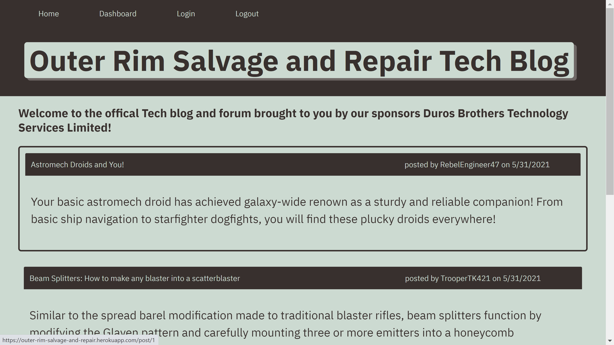

# Tech_Blog

##Table of Contents

  1:Installation

  2:Usage

  3:Licence

  4:Contributing

  5:Tests

  6:Questions

## 1:Installation
No installation necessary, just follow the link here! 
https://outer-rim-salvage-and-repair.herokuapp.com/

## 2:Usage
Use the navagation bars at the top to go to login, then signup. Once an account has been made you can then view posts, leave comments on posts, or go to your dashboard (via navigation button) which will allow you to create new posts, edit your existing posts, or even delete them all together. 

## 3:Contributing
I am accepting contributions to my code at this time. If you have futher questions or 
would like to contact me see the questions section of the readme

## 4:Tests
To test the project, simply download the required code and run the progamme with npm start after adding the schema and seeding to your mysql workbench. Any modification can be made after that point

## 5:Questions
If you have futher questions or would like to contribute, please contact me at one of the following

GitHub:

https://github.com/lordgeer 

Email:

thomas.g.musler@gmail.com 

## 6:Licence
MIT